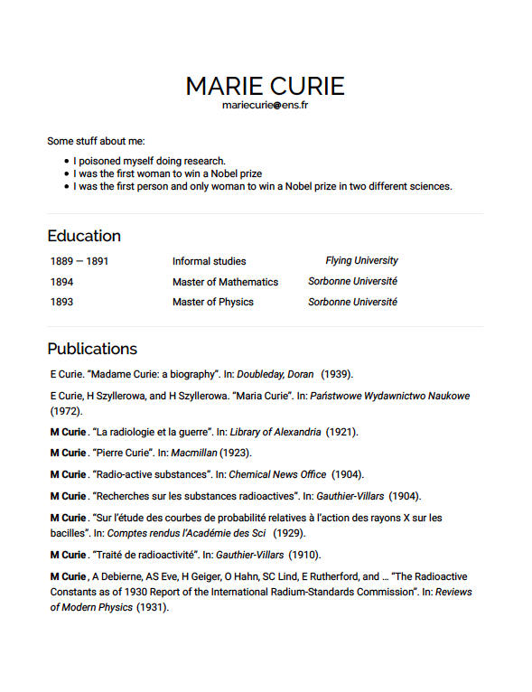
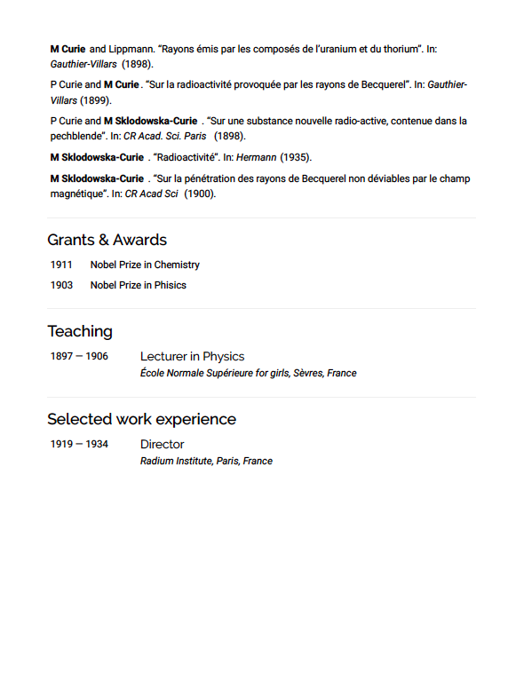

# cait-vitae
General template for creating a CV in Rmarkdown, autofilled from a google sheets. 

## Why

While making my own CV, I found some awesome elements that I liked from [Ulrik Lyngs](https://ulriklyngs.com/). However, working out the intricacies of how he supports [various formatting options](https://github.com/rstudio/pagedown) took some time, so I pared the principles behind his design down to only what I need.

As of April 2020, use this format to curate both my [personal webpage](https://harrig12.github.io/cait/), and my long-form CV. To this end, I have designed this template such that it displays well as a simple static html webpage, and prints nicely to PDF. 

## Getting started

### Editing from the template

To personalize this template to your own CV content, you will need to maintain a spreadsheet of your CV data. I use google sheets for this purpose, but excel or csv will be equally appropriate. 

The main idea is this: all your CV data is in a spreadsheet (with possibly the exception of publication references), and you can select an appropriate subset of entries to show in each section by setting `show = TRUE` in the spreadsheet.

1. Edit `index.Rmd` as you see fit for spacing/content of each section. In principle, I filter the cv data by section, then use `dplyr` and `knitr` to sort and arrange a table of entries. Some longer sections share a similar style, which I captured in the funtion `longDesc()`. You may find there is an easy equivalent for short sections, but I prefered to format these each separately as I found they were more heterogenious in nature. 

2. Make a copy of the [example spreadsheet](https://docs.google.com/spreadsheets/d/1bzHcV8x1I4Z7tOA52dkKLEh27gUR39R3NelefmdrKgw/edit?usp=sharing), and make your sharing settings are set such that anyone with the link can view your sheet. Replace the sheet ID in `index.Rmd` with your new sheet ID. Sections will automatically appear/disappear as entries are added/remoed from the spreadsheet, so long as the section is already defined in `index.html`. You can of course, add your own sections as desired. 

3. You may wish to bold a name in the publications section. Find this in the code chunk titled "pubs-setup" in `index.Rmd`, and replace your name as appropriate. 

4. Find and replace `curie.jpg` as appropriate to change your TOC background, favicon (see `files/style.css` and `files/header.html` respectively). 

### Changing stylistic elements

This template is purposely very bare-bones, intended for a quick start and minimal meddling. If you find it's not flexible enough for you, there are some great options through the [vitae package](https://cran.r-project.org/package=vitae), which I recommend looking at if you are a more advanced user. 

The easiest two elements to change are the main colours and fonts. I have placed all the css for this in `files/style.css`. [Google fonts](https://fonts.google.com/) has a lovely interface to choose font pairings, and when you're happy with your selection, you can just link the style sheets in `files/header.html`. 

### Rendering

The document can be rendered using `knitr`. This will output an html file. If you want a pdf output, I recommend setting `toc: false` in the yaml header of `index.html` befor knitting. Then, simply open the html file with your browser of choice, and print to pdf. Rmarkdown is great for [knitting straight to pdf](https://bookdown.org/yihui/rmarkdown/pdf-document.html), but I have set some parameters that will make the html and pdf output look more similar together if you print to pdf in this way (see `files/style.css`). Additionly, I used some html directly within index.Rmd, meaning it may be challenging to move to a different type of output without significantly changing the structure of the template. 

### Output

The output looks nice as an html page, and once printed to pdf. 

#### as an html webpage

#### printed to pdf

page 1| page 2
:-------------------------:|:-------------------------:
  |  
