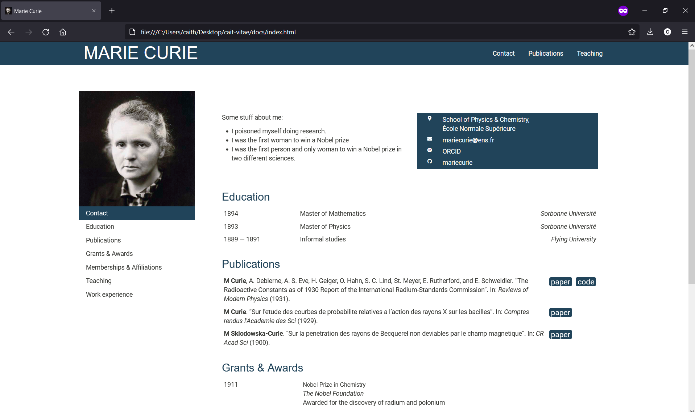

# cait-vitae
General template for creating a CV in Rmarkdown, autofilled from a google sheets. 

## Why

While making my own CV, I found some awesome elements that I liked from [Ulrik Lyngs](https://ulriklyngs.com/). However, working out the intricacies of how he supports [various formatting options](https://github.com/rstudio/pagedown) took some time, so I pared the principles behind his design down to only what I need.

As of August 2021, use this format to render both my [personal webpage](https://www.cs.toronto.edu/~charrigan/), and my CV. To this end, I have designed this template such that it displays well as a simple static html webpage, and prints nicely to PDF. 

## Pros

* All CV content is managed in google sheets. This makes it fast to update, easy to maintain, and trivial to add and remove entries to customize a CV for a particular use.
* Reduce time spent trying to format an invisible table in Word by 400%
* It keeps my website up-to-date with my CV, and they are never inconsistent 
* All publications can be managed through bibtex

## Cons

* I'm not that experienced at CSS so there are some oddities I'm still working on
* Only possible to render either the website or the printable CV, not both at once
  * You can work around this completely by not including a TOC in your site, but I like having it on mine so there is a tiny extra, "manual" step to switch between them
* It's not fully programmatic; you still have to put in headers by hand, and sometimes force a pagebreak, depending on your content
* I've not done much work on making this robust against bad input in the google sheet

## Getting started

### Editing from the template

To personalize this template to your own CV content, you will need to maintain a spreadsheet of your CV data. I use google sheets for this purpose, but excel or csv will be equally appropriate. 

The main idea is: all your CV data is in a spreadsheet (with possibly the exception of publication references), and you can select an appropriate subset of entries to show in each section by setting `show = TRUE` in the spreadsheet.

1. Make a copy of the [example spreadsheet](https://docs.google.com/spreadsheets/d/1bzHcV8x1I4Z7tOA52dkKLEh27gUR39R3NelefmdrKgw/edit?usp=sharing). For ease of use, I use `gs4_deauth()`, so your sharing settings should be set such that anyone with the link can view your sheet (but it's possible to chang this to require a login). Replace the sheet ID in `index.Rmd` with your new sheet ID. Experimental: see branch [magic-hide](https://github.com/harrig12/cait-vitae/tree/magic-hide) for some sneaky use of html comments to make sections automatically appear/disappear as entries are added/removed from the spreadsheet, so long as the section is already defined in `index.html`.  

1. Edit `index.Rmd` for your sections and content! In principle, I filter the cv data by section, then use `dplyr` and `knitr` to sort and arrange a table of entries. I have two formatting functions, `shortEnrty()` and `longEntry()`. I've found that the short entries sometimes need a but of custom formatting (by changing the column widths to suit the content) as in general they are more heterogeneous in nature.

1. You may wish to bold a name in the publications section. Find this in the code chunk titled "publications" in `index.Rmd`, and replace your name as appropriate. 

1. Find and replace `curie.jpg` as appropriate to change your TOC background, favicon (see `files/style.css` and `files/header.html` respectively). 

### Changing stylistic elements

This template is purposely very bare-bones, intended for a quick start and minimal meddling. If you find it's not flexible enough for you, there is the [vitae package](https://cran.r-project.org/package=vitae), but this only allows PDF output.

The easiest two elements to change are the main colours and fonts. I have placed all the css in `files/style.css`. There is a section that will change formatting such that it only applies to the printed PDF version of the CV. [Google fonts](https://fonts.google.com/) has a lovely interface to choose font pairings, and when you're happy with your selection, you can just link the style sheets in `files/header.html`. 

### Rendering

The document can be rendered using `knitr`. This will output an html file. If you are creating a PDF CV, Set `toc: false` in the yaml header of `index.html` befor knitting. Then, simply open the html file with your browser of choice, and print to PDF. This is an unusual instruction, because Rmarkdown is great at [knitting straight to pdf](https://bookdown.org/yihui/rmarkdown/pdf-document.html). However, I've so far found that it's a lot easier to make small tweaks to CSS and html, than trying to get into the weeds of latex for this purpose. (I love latex for other things!). I have set some parameters that will make the html and pdf output look more similar together if you print to PDF after generatingt he html (see `files/style.css`). Additional, I used some html directly within index.Rmd, meaning it may be challenging to move to a different type of output without significantly changing the structure of the template. 

In my personal use, I use the `toc: false` to toggle whether I want to output everything (ie. my CV) or a restricted set of sections (for my public webpage), in addition to set a few other web-only things (the TOC for one, but also links to my papers and code). 

## Output

The output looks nice as an html page, and once printed to PDF. 

### as an html webpage

### printed to pdf

## Set up gh-pages

Once rendered, you can set docs/ folder as your [publishing source for gh-pages](https://docs.github.com/en/pages/getting-started-with-github-pages/configuring-a-publishing-source-for-your-github-pages-site). 
